# About  
  
PyNotes is a very advanced cross-platform editor and IDE made in Python.  
## Important Features  
* **Programming** - Syntax highlighting and running code with outputs and errors for Python, LaTeX, and HTML! Also has a shell for python and graphical tools for formatting LaTeX.  
* **Commands** - Powerful Emacs-like commands and options inside PyNotes! (Alt-X to use)  
* **Plugins** - Extensions that can do anything within PyNotes and change it in any way! You can get them from anywhere or make your own. Made by me are: Letter Invaders Game (A fun typing game), Typing (A typing test that also gives feedback and suggestions), 3D Maze Game (A 3D Maze Game with a simple AI as an opponent also), Simple Spellcheck (Spellcheck for the editor with the option to change or add dictionaries), ChessPy (A Chess Program where you can play 2 player or with any engine you provide)  
* **PyCode** - Small programming language inside PyNotes to customize it even beyond plugins! You can make your own keyboard shortcuts, startup code, etc.  
* **MathGod** - Notebook like Mathematica for math inside PyNotes!  
* **Email** - Send emails from within PyNotes! Also has a spellcheck and option to change or add new dictionaries for the spellcheck.  
* **Modes** - Modes like Emacs for different purposes! Changes syntax highlighting, running code, tabs, etc. (Change with command `hmode:{py|la|norm|em}` for Python Mode, LaTeX Mode, Normal Text Mode, and Email Mode.)  
* **Text to speech** - Make PyNotes speak your selection inside the editor!  
* **Speech to text** - Dictate to write text in the editor!  
* **Terminal** - Terminal or Commmand Prompt inside PyNotes!  
* **Preferences** - Fully customize your syntax highlighting and options easily in the preferences!  
* **Backup** - Auto backup option to save your files!  
* **Quick Installation** - Fast installation with an installer script for Linux and Windows!  
* **And many more!**  
## Screenshots  
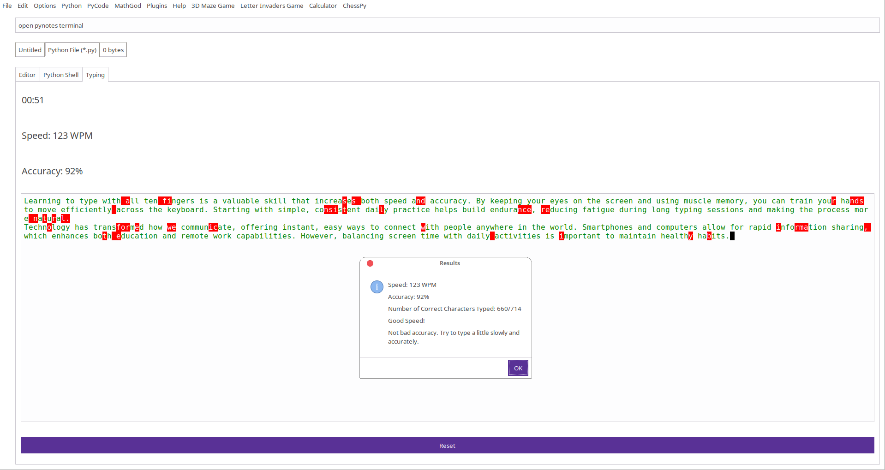  
  
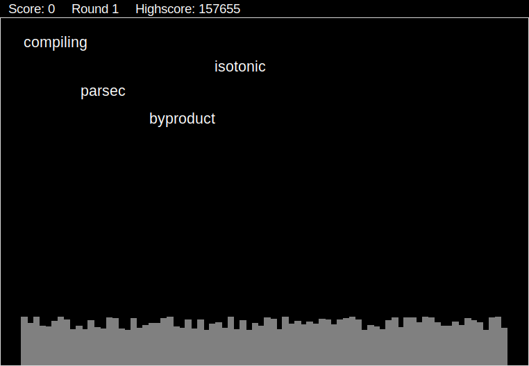  
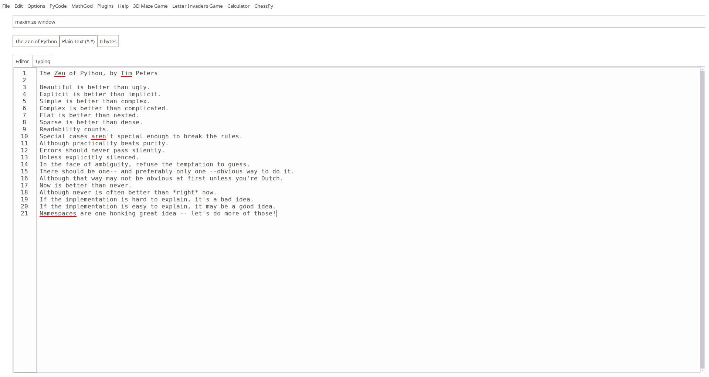  
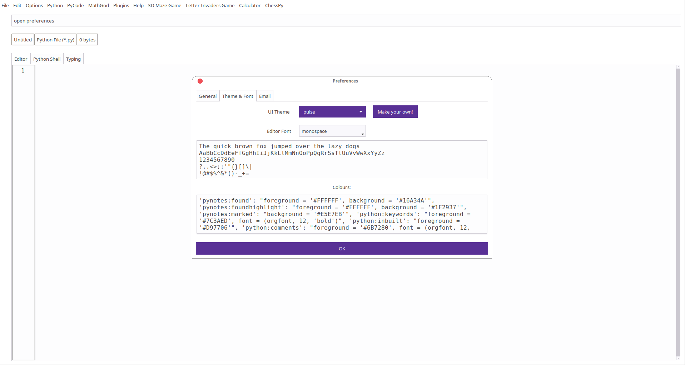  
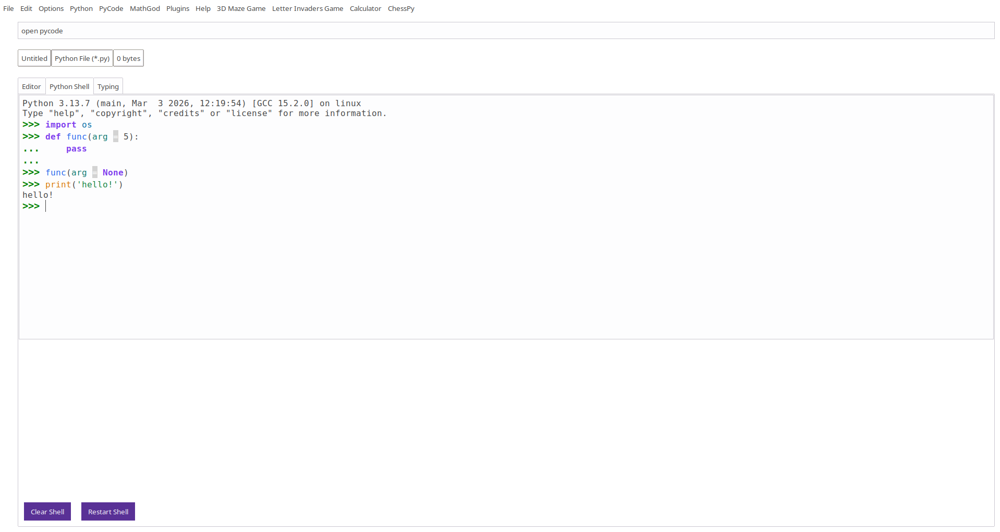  
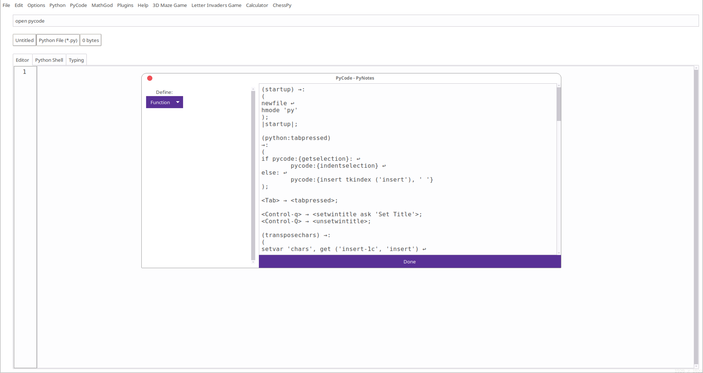  
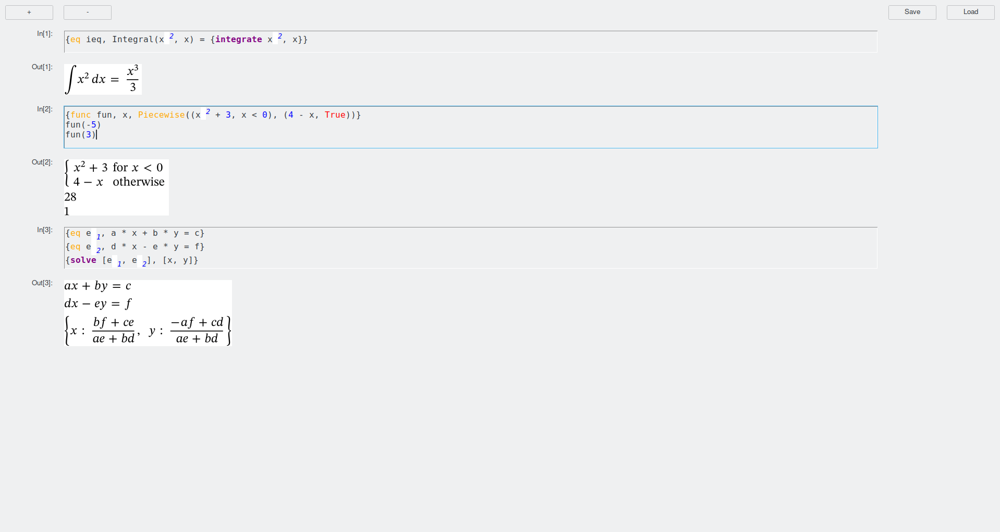  
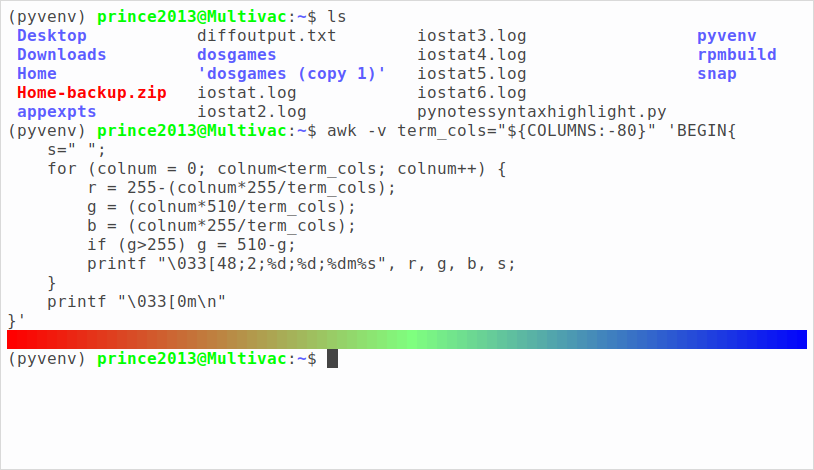  
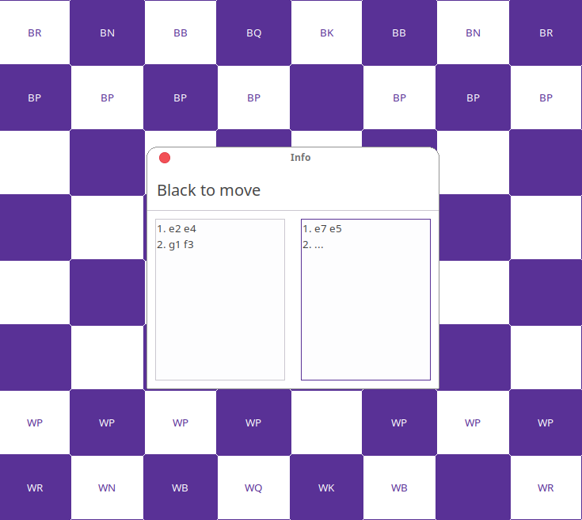  
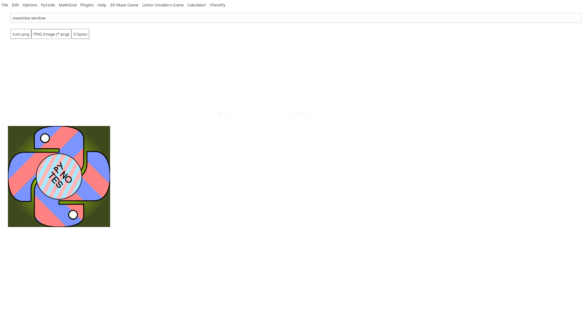  
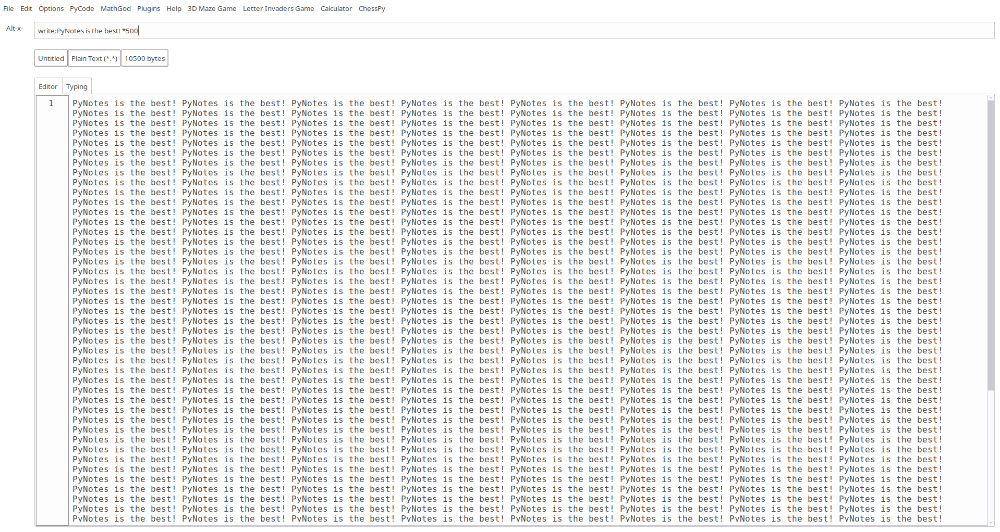  
# Installation  
System: Ubuntu or Windows 10 / 11 with python 3.10 or above (Everything may not work with older versions).  
**Easytk needs ttkthemes to work. It is automatically installed with other packages from version 1.4.2. For older versions, install with:**  
`pip3 install ttkthemes`  
## Images  
## Linux  
**Note:** In some distros or versions of Linux, tkinter or pip may not come installed. You will then have to manually install tkinter and pip. Example: `sudo apt install python3-tk` and `sudo apt install python3-pip` for Ubuntu. You can also run PyNotes inside a virtual environment.  
**Note:** In older versions of PyNotes, if you are using Ubuntu 23 or later, you may get an error like this when PyNotes tries to install the dependencies using pip:  
```
error: externally-managed-environment  
  
× This environment is externally managed  
╰─> To install Python packages system-wide, try apt install  
    python3-xyz, where xyz is the package you are trying to  
    install.  
      
    If you wish to install a non-Debian-packaged Python package,  
    create a virtual environment using python3 -m venv path/to/venv.  
    Then use path/to/venv/bin/python and path/to/venv/bin/pip. Make  
    sure you have python3-full installed.  
      
    If you wish to install a non-Debian packaged Python application,  
    it may be easiest to use pipx install xyz, which will manage a  
    virtual environment for you. Make sure you have pipx installed.  
      
    See /usr/share/doc/python3.12/README.venv for more information.  
  
note: If you believe this is a mistake, please contact your Python installation or OS distribution provider. You can override this, at the risk of breaking your Python installation or OS, by passing --break-system-packages.  
hint: See PEP 668 for the detailed specification.  
```
If this happens, you should upgrade your PyNotes version to 1.6 or later, which avoids this problem entirely. Otherwise (Not recommended), you can install the required modules manually with `--break-system-packages` (the modules PyNotes and it's add-ons need do not break system packages, this warning is because some other modules might break system packages), run PyNotes inside a Virtual Machine, or remove or move the file `/usr/lib/python3.*/EXTERNALLY-MANAGED` to stop this warning forever.  
### Debian Package  
There is a `.deb` package inside every `tar.gz` inside every version folder. You can install this manually with:  
`sudo dpkg -i PyNotes.deb`  
### Debian Package Installer Script  
Run the [pynotes_debian_installer.sh](pynotes_debian_installer.sh) script with root. You can give a specific version as an argument, or it will install the latest version.  
Command: `sudo pynotes_debian_installer.sh {version no. or blank}`  
### RPM Package  
There is a `.rpm` package inside every `tar.gz` inside every version folder. You can install this manually with:  
`sudo rpm -i --replacefiles *.rpm`  
### RPM Package Installer Script  
Run the [pynotes_rpm_installer.sh](pynotes_rpm_installer.sh) script with root. You can give a specific version as an argument, or it will install the latest version.  
Command: `sudo pynotes_rpm_installer.sh {version no. or blank}`  
## Windows  
1. Download Python from [here](https://www.python.org/downloads/windows/).  
2. Run the installer to install Python. Make sure to check add Python to PATH.  
3. Run the [pynotes_windows_installer.py](pynotes_windows_installer.py) script with Python, or using the command-line command `python pynotes_windows_installer.py`.  
4. It will then open a graphical installer, where you can select the version and install it. This script can also upgrade or downgrade your PyNotes version.  
# Plugins  
**Note:** If PyNotes is open when you install a new plugin, you will have to restart it for the plugin to work, as plugins are loaded only on startup.  
## Script  
This script works on both Linux and Windows. Run the `pynotes_plugin_installer.py` with Python and it will open a window where you can select the plugin(s) from PyNotes' GitHub to install. Once you are done, it will automatically download and install the plugins you have selected.  
## Manual  
Download the plugins from the `Plugins/` folder. You can also make your own or get them from somewhere else. Then extract them if they are compressed, and move the folder to `~/.local/share/PyNotes/add-ons/` on Linux, and `C:/Users/{Your Username}/.local/share/PyNotes/add-ons` on Windows.  
**Note:** Be careful in downloading plugins from other sources, as they will have full access to your system and be able to run any commands.  