# About  
  
PyNotes is an advanced cross-platform text editor and IDE made in Python.  
Links: [GitHub](https://github.com/rafugafu/pynotes), [Codeberg](https://codeberg.org/rafugafu/pynotes), [Sourceforge](https://sourceforge.net/projects/pynotespython/), [Launchpad PPA](https://launchpad.net/~rafugafu/+archive/ubuntu/pynotes)  
## Important Features  
* **Programming** - Efficient syntax highlighting and running code with outputs and errors for Python, LaTeX, and HTML! Graphical buttons for formatting LaTeX!  
* **Advanced Syntax Highlighting** - Advanced scope aware AST based syntax highlighting for Python!  
* **Code Navigation Commands** - Advanced code navigation commands for Python!  
* **Alt-X Commands** - Powerful Emacs `M-x` like commands inside PyNotes!  
* **Plugins** - Powerful extensions that seamlessly integrate with PyNotes! Very easy to make and install!  
* **PyCode** - Full programming language inside PyNotes to customize it even beyond plugins! You can make and change your own keyboard shortcuts, functions, Alt-X commands, event hooks, startup code, etc! Optional graphical programming options to use without knowing PyCode syntax!  
* **Infinite Length Chord Keys** - Infinite length chord keys like Emacs possible to define in PyCode!  
* **Emacs-like Buffers** - Emacs-like buffers (editors) to edit multiple files at once!  
* **Terminal** - Full 256-color/truecolor supporting terminal using a PTY inside PyNotes!  
* **Python Shell / REPL** - Full Python shell / REPL using a PTY inside PyNotes!  
* **HModes** - Major Modes like Emacs for different purposes! Changes syntax highlighting, running code, menus, tabs, etc.  
* **Preferences** - Fully customize your syntax highlighting and options easily in the preferences!  
* **Incremental Search** - Incremental search for Find and Find & Replace - Find strings without fully typing them!  
* **Regexp Search** - Find and Find & Replace using regexp!  
* **MathGod** - Mathematica-like notebook for symbolic math inside PyNotes!  
* **Email** - Send emails from within PyNotes! Also has a spellcheck and option to change or add new dictionaries for the spellcheck.  
* **Text to Speech** - Make PyNotes speak your selection inside the editor!  
* **Speech to Text** - Dictate to write text in the editor!  
* **Auto Backup** - Auto backup option to save your files!  
* **Quick Installation** - Fast (optionally) automatic installation with an installer script for Linux and a graphical installer for Windows!  
* **Full Builtin Help Texts** - Builtin help including example code and screenshots for PyCode, MathGod, Alt-X commands, and all the other PyNotes features!  
* **And much more!**  
## Screenshots  
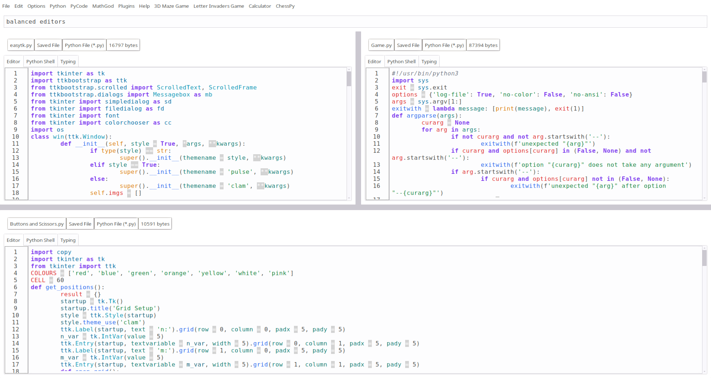  
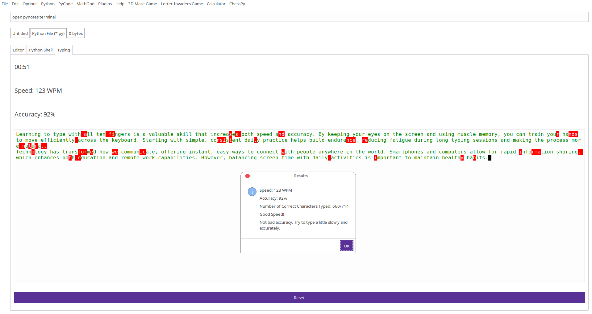  
  
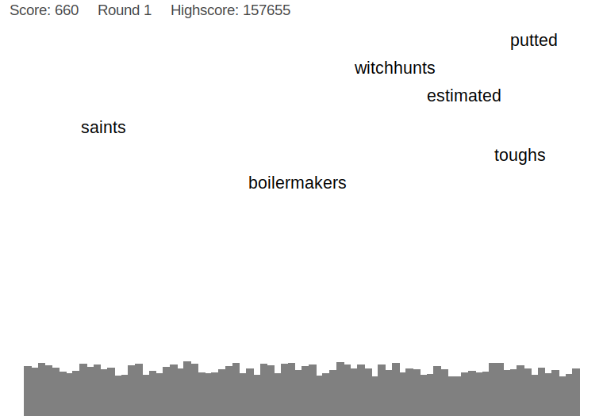  
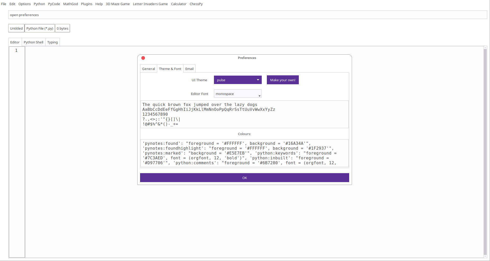  
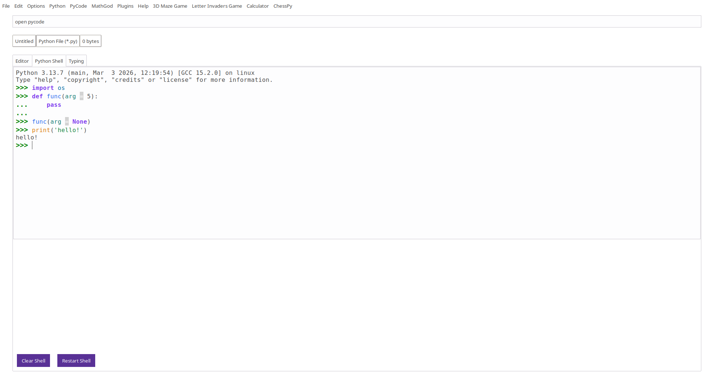  
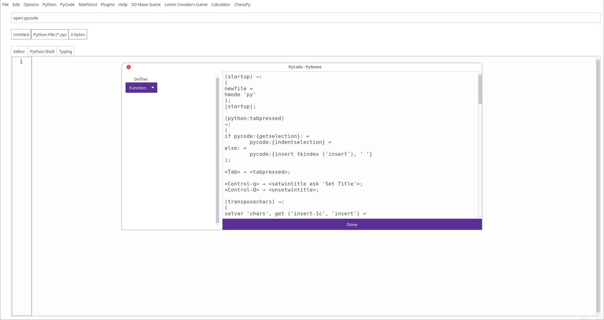  
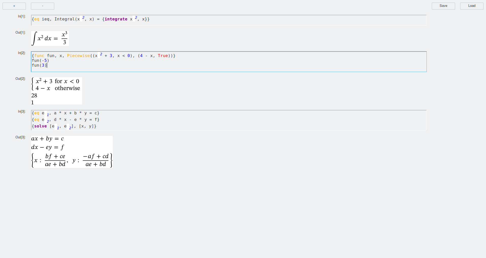  
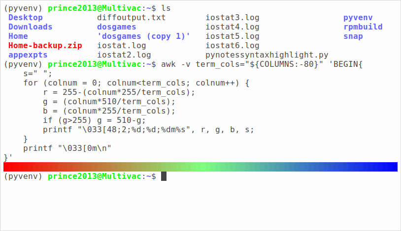  
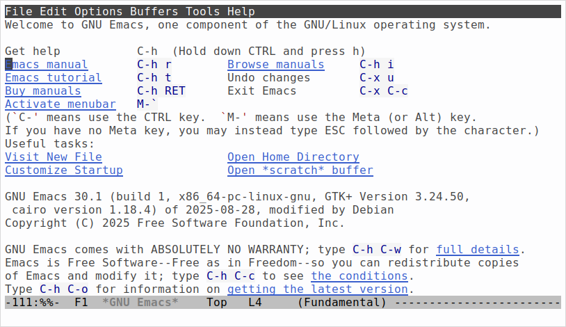  
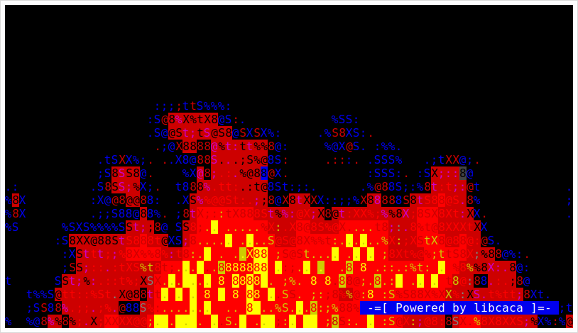  
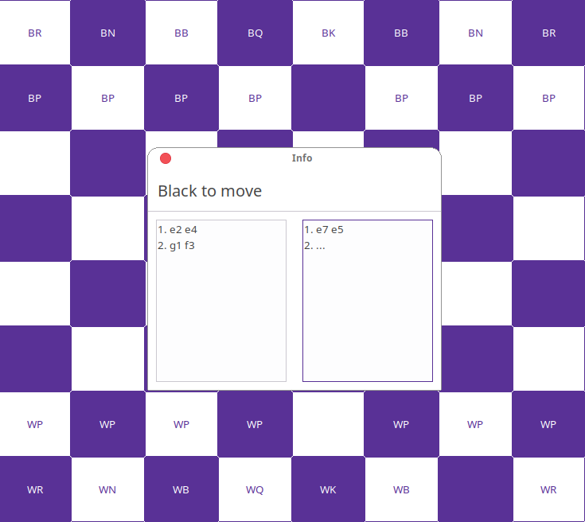  
  
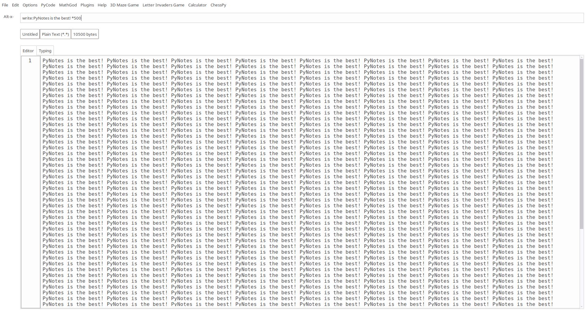  
# Installation  
For Windows, download Python from [here](https://www.python.org/downloads/windows/).  
Click [here](pynotes_debian_installer.sh) to download the Debian installer script, [here](pynotes_rpm_installer.sh) for the RPM installer script, and [here](pynotes_windows_installer.py) for the Windows Installer.  
**Note:** The installation scripts only work for PyNotes versions more than v2.1.  
For PyNotes version v1.8 and above, you might also have to manually download the Cairo C library. For Linux, install these packages: `python3-tk, python3-venv, zenity, libcairo2-dev, python3-dev, libffi-dev, pkg-config` (names may vary for your distribution). The `.deb` and `.rpm` packages also contain all the dependencies. For Windows, follow [this](https://www.gtk.org/docs/installations/windows).  
System: Linux or Windows with Python 3.10 or above.  
**Easytk in PyNotes version < v1.9 needs ttkthemes to work. It is automatically installed with other packages from PyNotes version 1.4.2. For older versions, install with:**  
`pip install ttkthemes`  
**Note:** Instead of this, it is highly recommended to upgrade PyNotes to a newer version. v1.4.2 is very old.  
## Sourceforge  
Download from [Sourceforge](https://sourceforge.net/projects/pynotespython/).  
## Linux  
**Note:** In some distros or versions of Linux, tkinter or pip may not come installed. You will then have to manually install tkinter and pip. Example: `sudo apt install python3-tk` and `sudo apt install python3-pip` for Ubuntu. You can also run PyNotes inside a virtual environment.  
**Note:** In older versions of PyNotes, if you are using Ubuntu 23 or later, you may get an error like this when PyNotes tries to install the dependencies using pip:  
```  
error: externally-managed-environment  
  
× This environment is externally managed  
╰─> To install Python packages system-wide, try apt install  
    python3-xyz, where xyz is the package you are trying to  
    install.  
  
    If you wish to install a non-Debian-packaged Python package,  
    create a virtual environment using python3 -m venv path/to/venv.  
    Then use path/to/venv/bin/python and path/to/venv/bin/pip. Make  
    sure you have python3-full installed.  
  
    If you wish to install a non-Debian packaged Python application,  
    it may be easiest to use pipx install xyz, which will manage a  
    virtual environment for you. Make sure you have pipx installed.  
  
    See /usr/share/doc/python3.12/README.venv for more information.  
  
note: If you believe this is a mistake, please contact your Python installation or OS distribution provider. You can override this, at the risk of breaking your Python installation or OS, by passing --break-system-packages.  
hint: See PEP 668 for the detailed specification.  
```  
If this happens, you should upgrade your PyNotes version to 1.6 or later, which avoids this problem entirely. Otherwise (Not recommended), you can install the required modules manually with `--break-system-packages` (the modules PyNotes and it's add-ons need do not break system packages, this warning is because some other modules might break system packages), run PyNotes inside a Virtual Machine, or remove or move the file `/usr/lib/python3.*/EXTERNALLY-MANAGED` to stop this warning forever.  
### PPA for Ubuntu  
Add the PyNotes Launchpad PPA with the command: `sudo add-apt-repository ppa:rafugafu/pynotes`  
Then, run `sudo apt update`  
Now PyNotes should be installable through apt like any other package. Run `sudo apt install pynotes` to install it along with its dependencies. You will also be able to upgrade PyNotes through `sudo apt upgrade`.  
### Debian Package  
Download a `.deb` package from the   
### Debian Package Installer Script  
Run the [pynotes_debian_installer.sh](pynotes_debian_installer.sh) script with root. You can give a specific version as an argument, or it will install the latest version.  
Command: `sudo ./pynotes_debian_installer.sh {version no. or blank}`  
### RPM Package  
Download a `.rpm` package from the   
### RPM Package Installer Script  
Run the [pynotes_rpm_installer.sh](pynotes_rpm_installer.sh) script with root. You can give a specific version as an argument, or it will install the latest version.  
Command: `sudo pynotes_rpm_installer.sh {version no. or blank}`  
## Windows  
1. Download Python from [here](https://www.python.org/downloads/windows/).  
2. Run the installer to install Python. Make sure to check add Python to PATH.  
3. Run the [pynotes_windows_installer.py](pynotes_windows_installer.py) script with Python, or using the command-line command `python pynotes_windows_installer.py`.  
4. It will then open a graphical installer, where you can select the version and install it.  
# Plugins  
**Note:** If PyNotes is open when you install a new plugin, you will have to restart it for the plugin to work, as plugins are loaded only on startup.  
**Note:** The plugins given here only work PyNotes v2.0 and newer, since all older plugins broke because of the massive changes in v2.0. For plugins for older versions of PyNotes, download plugins from an [older release](https://github.com/rafugafu/pynotes/releases).  
Check [this](Plugins/list) for a list of available plugins.  
## PyNotes Builtin Management  
Use PyNotes command line arguments to manage plugins automatically:  
* `--plugin-list-installed` - List the currently installed plugins with a one line description for each if provided.  
* `--plugin-list-github` - List the plugins on the PyNotes GitHub with a one line description for each.  
* `--plugin-describe "plugin name"` - Describe the given plugin in detail if installed, search on GitHub if not.  
* `--plugin-install "plugin name"` - Installs the plugin if it exists on the PyNotes GitHub.  
* `--plugin-remove "plugin name"` - Uninstalls the given plugin if installed.  
## Script Installation  
This script works on both Linux and Windows. Run the `pynotes_plugin_installer.py` with Python and it will open a window where you can select the plugin(s) from PyNotes' GitHub to install. Once you are done, it will automatically download and install the plugins you have selected.  
## Manual Installation  
Download the plugins from the `Plugins/` folder. You can also make your own or get them from somewhere else. Then extract them if they are compressed, and move the folder to `~/.local/share/PyNotes/add-ons/` on Linux, and `C:/Users/{Your Username}/.local/share/PyNotes/add-ons` on Windows.  
**Note:** Be careful in downloading plugins from other sources, as they will have full access to your system and be able to run any commands.  
# Command Line Arguments  
These are the command line arguments PyNotes accepts except for the plugin management ones:  
* `--version` - Prints the current PyNotes version.  
* `--changes` - Prints the current PyNotes version's changelog.  
* `--no-load-pycode` - Starts PyNotes without loading your PyCode configuration.  
* `--no-load-plugins` - Starts PyNotes without loading any plugins.  
* `--pycode-exec "string"` - Executes the given string as PyCode after loading your normal configuration.  
* `--command-exec "string"` - Executes the given string as Alt-X commands after loading your normal configuration.  
You can also use `pynotes --help` for a complete list.  
# PyCode Emacs Config  
**Note:** This config only works on PyNotes versions 1.8 and above, as it uses chord keybindings, which did not exist before PyNotes v1.8.  
## What it does  
This PyNotes Emacs config copies the following Emacs `M-x` commands and keybindings:  
### Emacs M-x Commands  
* `transpose-chars` - Transpose (swap) the two characters behind the cursor in the editor.  
* `query-replace` - Find & Replace.  
* `kill-ring-save` - Copy selected text.  
* `isearch-forward` - Find.  
* `kill-region` - Cut (kill) the selected text.  
* `yank` - Paste previously copied or cut text.  
* `move-beginning-of-line` - Move the cursor to the start of the current line.  
* `move-end-of-line` - Move the cursor to the end of the current line.  
* `next-line` - Move the cursor down one line.  
* `previous-line` - Move the cursor up one line.  
* `forward-char` - Move the cursor forward one character.  
* `backward-char` - Move the cursor backward one character.  
* `find-file` - Open a file.  
* `mark-whole-buffer` - Select all text in the buffer.  
* `save-buffers-kill-terminal` - Close PyNotes normally, after asking to save unsaved changes.  
* `save-buffer` - Save the current file.  
* `write-file` - Save As.  
* `undo` - Undo.  
* `python-mode` - Switch the HMode to Python.  
* `latex-mode` - Switch the HMode to LaTeX.  
* `html-mode` - Switch the HMode to HTML.  
* `text-mode` - Switch the HMode to Normal.  
* `kill-line` - Cut (kill) text from the cursor to the end of the line.  
* `kill-whole-line` - Cut (kill) the entire current line.  
* `goto-line` - Go to a given line number.  
* `run-python` - Open the Python Shell.  
* `compile` - Run the code in the active editor.  
* `set-mark-command` - Set (or unset) the selection point at the cursor.  
* `keyboard-quit` - Remove the selection point and clear the current selection.  
* `beginning-of-defun` - Jump to the start of the current Python function/class.  
* `end-of-defun` - Jump to the end of the current Python function/class.  
* `xref-find-definitions` - Jump to the definition of a given variable name.  
* `other-window` - Switch to the next editor.  
* `delete-window` - Close the active editor.  
* `split-window-below` - Split the active editor vertically.  
* `split-window-right` - Split the active editor horizontally.  
* `balance-windows` - Balance all open editors to equal size.  
* `make-frame-command` - Open a new editor.  
* `find-file-other-frame` - Open a file in a new editor.  
### Emacs Keybindings  
* `Alt-semicolon` - Comment the current selection.  
* `Alt-percent` - Find & Replace.  
* `Alt-w` - Copy selected text.  
* `Control-slash` - Undo.  
* `Control-underscore` - Undo.  
* `Control-t` - Transpose (swap) the two characters behind the cursor in the editor.  
* `Control-s` - Find.  
* `Control-w` - Cut (kill) selected text.  
* `Control-y` - Paste previously copied or cut text.  
* `Control-a` - Move cursor to start of line.  
* `Control-e` - Move cursor to end of line.  
* `Control-n` - Move cursor to next line.  
* `Control-p` - Move cursor to previous line.  
* `Control-f` - Move cursor forward one character.  
* `Control-b` - Move cursor backward one character.  
* `Control-k` - Kill (cut) from cursor to end of line.  
* `Control-Alt-backslash` - Indent selected text.  
* `Alt-v` - Scroll/page backward.  
* `Control-v` - Scroll/page forward.  
* `Alt-less` - Move cursor to start of buffer.  
* `Alt-greater` - Move cursor to end of buffer.  
* `Control-Shift-BackSpace` - Kill (cut) the entire current line.  
* `Control-x & h` - Select the entire buffer.  
* `Control-x & Control-c` - Close the editor/application.  
* `Control-c & less` - Unindent selected text.  
* `Control-c & greater` - Indent selected text.  
* `Control-x & Control-s` - Save file.  
* `Control-x & Control-w` - Save As.  
* `Control-x & u` - Undo last change.  
* `Control-space` - Set (or unset) the selection point at the cursor.  
* `Control-g` - Remove the selection point and clear the current selection.  
* `Alt-period` - Jump to the definition of a given variable name.  
* `Control-Alt-a` - Jump to the start of the current Python function/class.  
* `Control-Alt-e` - Jump to the end of the current Python function/class.  
* `Control-c & Control-c` - Run the code in the active editor.  
* `Control-c & Control-z` - Open the Python Shell.  
* `Alt-g & g` - Go to a given line number.  
* `Control-x & 0` - Close the active editor.  
* `Control-x & o` - Switch to the next editor.  
* `Control-x & 2` - Split the active editor vertically.  
* `Control-x & 3` - Split the active editor horizontally.  
* `Control-x & plus` - Balance all open editors to equal size.  
* `Control-x & 5 & 2` - Open a new editor.  
* `Control-x & 5 & f` - Open a file in a new editor.  
## To Use  
For Emacs users, there is a readymade PyCode config in [pynotesemacsconfig.txt](pynotesemacsconfig.txt) that copies a lot of standard Emacs keybindings and `M-x` commands. To use it, open PyCode with `Alt-X pc`, and paste the contents of the file in the window that appears. Then, click the 'Done' button on the bottom. This automatically saves and applies the config to the instance of PyNotes you opened it in. For other already open PyNotes windows, just open PyCode and click 'Done' in them to apply the config. Alternatively, directly copy the file to `~/pynotes` on Linux, and `C:\Users\{yourusername}\.pynotes on Windows. This will only apply to PyNotes opened after this, or if you open PyCode and close it in already open PyNotes windows.  
**Note:** Make sure to close PyCode with the 'Done' button only, and not close the window in any other way, as this will cancel the changes to your PyCode config.  